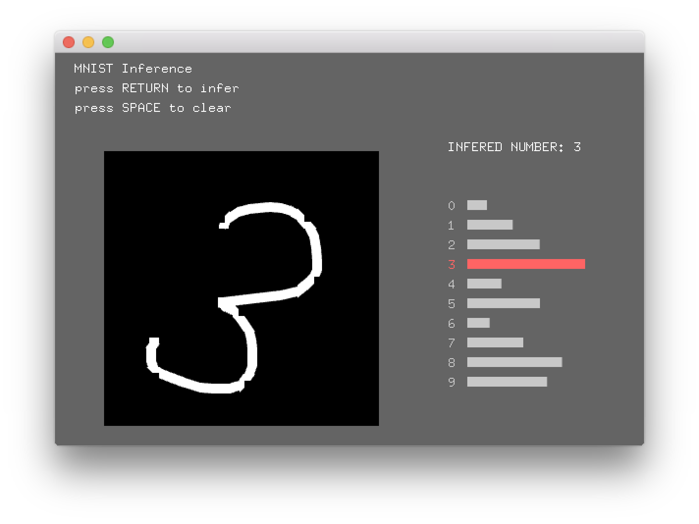

# ofxKerasify
openFrameworks addon for Running trained Keras Deep Learning models in C++.  

based on moof2k's wonderful kerasify project
[https://github.com/moof2k/kerasify](https://github.com/moof2k/kerasify)


# Disclaimer  

kerasify supports only a subset of keras layers. I'm working on more layers!


# Example: MNIST MLP (example-mnist_mlp)

1. Train MLP model for MNIST using Keras example
[https://github.com/fchollet/keras/blob/master/examples/mnist_mlp.py](https://github.com/fchollet/keras/blob/master/examples/mnist_mlp.py)

2. Save trained model  ` model.save('mnist_mlp.h5') `

3. "Kerasify" the saved model using python script

```
$ python convert_keras_model.py mnist_mlp.h5 mnist_mlp.model
```

4. Copy the converted model into "data" folder of ofApp

5. Load model

```
kerasify.loadModel("mnist_mlp.model");
```

6. Inference

```
// Image -> vector
ofPixels pix = img.getPixels();
std::vector<float> input;
for (int i = 0; i < pix.size(); i++){
    input.push_back(pix.getData()[i]/255.0);
}

// INFERENCE
output.resize(10); // output vector should be [10]. because we have 10 digits! ;-)
kerasify.predict(input, output);
```

7. Voi lla!


