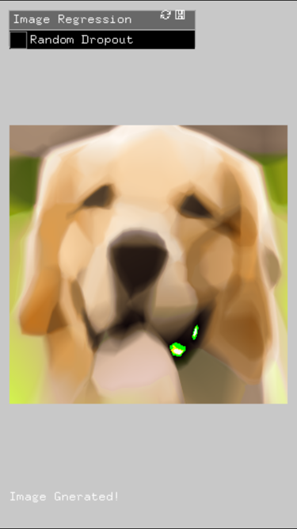
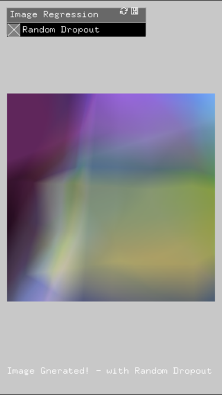

# ofxKerasify
openFrameworks addon for Running trained Keras Deep Learning models in C++.  

based on moof2k's wonderful kerasify project.
[https://github.com/moof2k/kerasify](https://github.com/moof2k/kerasify)


# Disclaimer  

* kerasify supports only a subset of keras layers. I'm working on more layers!
* not thread safe

* oF-iOS compatible
* Working on [BLAS Optimization through Accelerate.framework](https://github.com/jaegonlee/kerasify/tree/BLAS)


# Example 1: MNIST MLP (example-mnist_mlp)

1. Train MLP model for MNIST using Keras example
[https://github.com/fchollet/keras/blob/master/examples/mnist_mlp.py](https://github.com/fchollet/keras/blob/master/examples/mnist_mlp.py)

2. Save trained model  ` model.save('mnist_mlp.h5') `

3. "Kerasify" the saved model using python script

```
$ python convert_keras_model.py mnist_mlp.h5 mnist_mlp.model
```

4. Copy the converted model into "data" folder of ofApp

5. Load model

```
kerasify.loadModel("mnist_mlp.model");
```

6. Inference

```
// Image -> vector
ofPixels pix = img.getPixels();
std::vector<float> input;
for (int i = 0; i < pix.size(); i++){
    input.push_back(pix.getData()[i]/255.0);
}

// INFERENCE
output.resize(10); // output vector should be [10]. because we have 10 digits! ;-)
kerasify.predict(input, output);
```

7. Voila!


# Example 2: Image Regression for iOS (example-ios-imageregression)

*This sample project is for oF iOS*  

"Image Regression" - "treats the pixels of an image as a learning problem: it takes the (x,y) position on a grid and learns to predict the color at that point using regression to (r,g,b). It's a bit like compression, since the image information is encoded in the weights of the network, but almost certainly not of practical kind :)"" by [@karpathy](https://twitter.com/karpathy).

Here is his great [online demo](http://cs.stanford.edu/people/karpathy/convnetjs/demo/image_regression.html).


I trained a simple fully-connected 8-layer network for this image of dog.
https://github.com/naotokui/ChainerPainter/blob/master/ChainerPainter.ipynb  


You can run the trained model on iOS now!   
(Don't forget to use `convert_keras_model.py`)



Let's see what happens when you randomly disable one of trained layers.   


